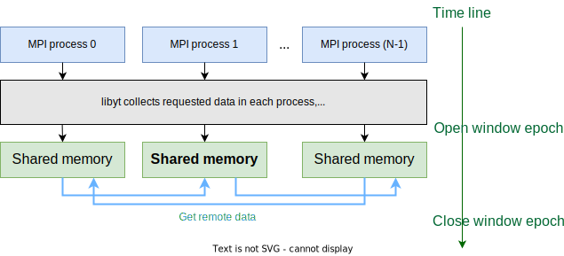

# How it Works
{: .no_toc }

  

    Table of contents
  

  {: .text-delta }
- TOC
{:toc}

---

## Target Problem

Simulations either need to have their own built-in tools to analyze these in-memory data,
or they need to output those data in files, so that researchers can process it later. They
often use efficient programming language like C/C++, while many data analysis tools are
written in Python.

In situ analysis tool, which enables us to explore these ongoing simulation data through
accessing memory directly is in demand, and reducing the conceptual distance between post-processing tools (which are typically more readily available and often more utilized) reduces
the barrier to entry and the likelihood of advanced computation. In situ analysis also provides
a viable solution for analyzing extreme scale simulations by processing data on-site, instead
of dumping simulation snapshots on disk.

## Overview of libyt
`libyt` serves as a bridge between simulation processes and Python instances.
It is the middle layer that handles data IO between simulations and Python instances, and between MPI processes.
When launching *N* MPI processes, each process contains one piece of simulation and one Python interpreter. 
Each Python interpreter has access to simulation data in its process.
When doing in situ analysis, every simulation process pauses, and a total of *N* Python instances will work together to conduct Python tasks in the process space of MPI.

Simulations use `libyt` API to pass in data and run Python codes during runtime,
and Python instances use `libyt` Python module to request data directly from simulations
using C-extension method and access Python objects that contain simulation information. 
Using `libyt` for in situ analysis is very similar to running Python scripts in post-processing
under MPI platform, except that data are stored in memory instead of hard drives.

`libyt` is for general-purpose and can launch arbitrary Python scripts and Python modules,
though here, we focus on using yt as our core analysis tool.

## Executing Python Codes 

Using `libyt` to run Python codes is just like running Python codes in post-processing.
Their only difference lies in where the data is.
Post-processing has everything store on hard disk, while data in in situ analysis is distributed
in different computing nodes.

When conducting in situ Python analysis, the simulation processes pause,
and Python instances on each process run and execute the same piece of code. 
Python instances use `libyt` Python module to probe and read ongoing simulation data, 
or even request data from simulation, thus realize in situ Python analysis. 
Python instances on different processes use `mpi4py` to communicate.
Though `libyt` can call arbitrary Python modules, here, we focus on using `yt` as the core method, 
since it already has supported parallelism feature under `mpi4py` platform.
Every Python statement is executed inside the imported script's namespace.
The namespace holds Python functions and objects. Every change made will also be stored under this
namespace and will be brought to the following round.

`libyt` also provides interactive Python prompt under MPI communication platform. 
We can think of it as normal Python prompt, but with access to simulation data.
It takes user inputs through the terminal on the root process. 
Once the root process makes sure the input syntax is complete and is a valid Python statement, 
it then broadcasts the statement to other MPI processes, and all the MPI processes run the Python statement together. 
The changes made will be brought to the following round of analysis.

## Connecting Data in Simulation to Python
todo

## Data Redistribution Process

Each MPI process contains one simulation code and one Python instance.
Each Python instance only has direct access to the data on local computing nodes.
During in situ Python analysis, workloads may be decomposed and rebalanced according 
to the algorithm in Python packages. 
It is not necessary to align with how data is distributed in simulation.
Furthermore, there is no way for `libyt` to know what kind of communication pattern a Python script needs for a much more general case. And it is difficult to schedule point-to-point communications that fit any kind of algorithms and any number of MPI processes. 

`libyt` use one-sided communication in MPI, also known as Remote Memory Access (RMA), by which one no longer needs to explicitly specify senders and receivers.
`libyt` first collects what data is needed in each process, and the processes prepare the data requested.
Then it creates a RMA epoch, for which all MPI processes will enter, and each process can fetch the data
located on different processes without explicitly waiting for the remote process to respond. 
It only needs to know which MPI process should it go to get the data.
The caveat in data redistribution process in `libyt` is that it is a collective operation, and requires every
MPI process to participate, otherwise, the process will hang there and wait for the others. 

